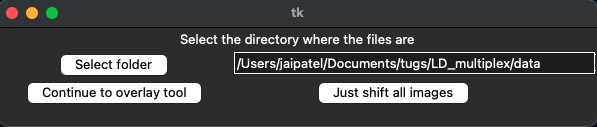
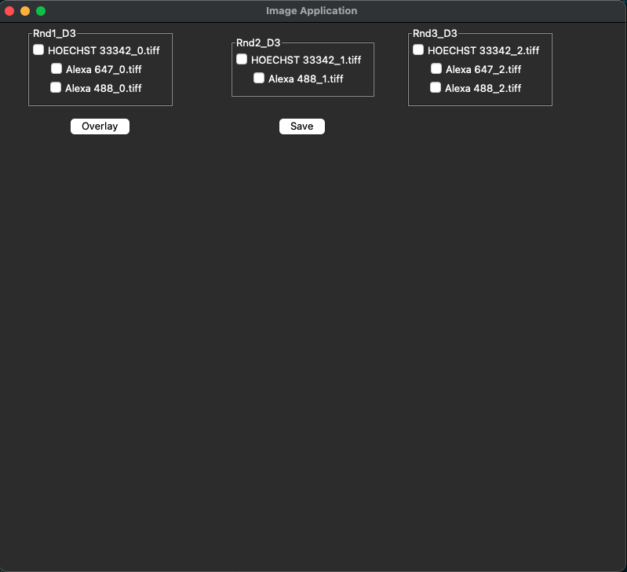
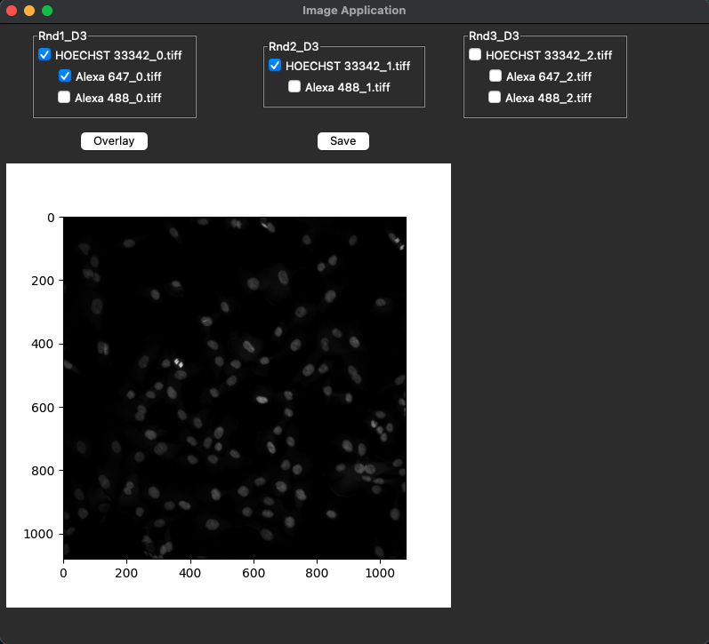

# ImageTranslator

Program assumes a folder structure like the following

```
Root directory
│   README.md
│   converter.pyp
|   gui.py
│
└─── data
    │
    └─── Rnd1_D3
    |    |   Alexa 488z1.tif
    |    |   ...
    └─── Rnd2_D3
    |   |   Alexa 488z1.tif
    |   |   ...
    └─── Rnd3_D3
        |   Alexa 488z1.tif
        |   ...

```

## How to use

1. Clone the repo to desired location
2. From the root repo directory run `python image_tool/main.py` using the required mode
3. If headless mode selected you do not need to read anymore
4. You will see the following interface on load:
   
   a. Select the directory of the data
   b. Click on the option you want
5. If "Overlay tool" selected you will see the following interface:
   
   a. Select the images you want to overlay
   b. 

### Options

`--root-file-path` - The path to the images (must be in the structure above).
`--headless` - If you just want to shift the images, run in headless most - root file path MUST be chosen. Default: false

### Developer Information

This application is in early release and still being developed.

### Current project flow

Project has two main classes

```python
class OverlayTool():
    ...
class Converter():
    ...
```

#### `OverlayTool` class

Main GUI class which handles the overlay tool:


1. Setup the canvas
   - Setup the buttons and fields on the page
2. Setup and link the radio buttons for the images
   - Look through the different rounds (of the stacked non-shifted images) and create IntVar's for each one to keep track of if they're selected or not
3. If 'overlay' or 'save' image is pressed, we need to determine which radio buttons have been selected. So loop through the dictionary created in step 2, and find all the selected images.
4. Read the images and stack them, then either save or overlay the images

View docstrings for any other functions

#### `Converter` class

Main class to handle image processing - this is due for a refactor

1. Find all of the rounds within the provided folder
2. Dive into the first folder and retrieve the image names (this should reflect all of the image names in all of the rounds)
   a. We need to stack images of the same FOV for the same well
   b. From the data provided, images of the same FOV are suffixed by 'z1' or 'z2', with the same well name. So we look through the first round and remove suffixes where required to find all of the wells and FOV's
   c. Now we know all of the wells / rounds, we go through each round and stack the images and save them a new directory
   Example:
   If you say the data is stored in 'C:/Windows/Users/user/data', the new shifted images will be stored in 'C:/Windows/Users/user/processed_images'
3. Now the images have been stacked, time to shift them. We calculate how much to translate each round by using HOECHST as a base.
   Example:
   There are 3 rounds 1,2,3. Each round has images of 3 wells HOECHST, Well2, Well3.
   This means there are 3 HOECHST images. We find the translation between round 1 HOECHST and round 2 HOECHST, and the translation between round 1 HOECHST and round 3 HOECHST. These translations are then saved for later and used to translate all images from that round.
4. Now we know how to translate the images, when we want to shift the images, we use the translations from step 3 to shift the images from all the rounds. If you say the data is stored in 'C:/Windows/Users/user/data', the new shifted images will be stored in 'C:/Windows/Users/user/shifted_images'
